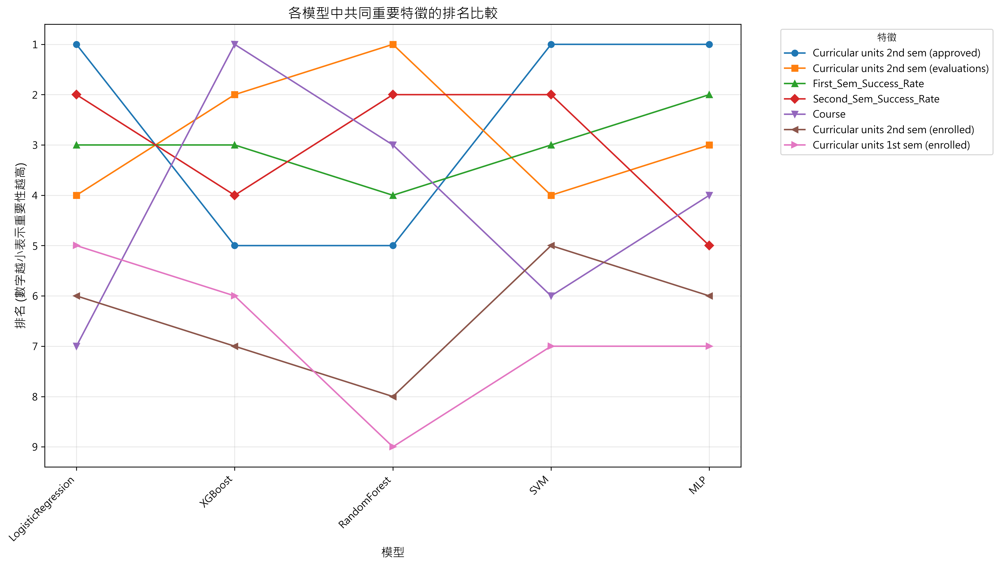

# 機器學習模型比較報告

## 比較的模型
- LogisticRegression
- XGBoost
- RandomForest
- SVM
- MLP

## 問題類型
- 多分類問題
- 目標類別: Dropout, Enrolled, Graduate

## 最佳模型
**LogisticRegression**

### 評估指標
- **accuracy**: 0.7153
- **f1_macro**: 0.6763
- **precision_Dropout**: 0.7881
- **recall_Dropout**: 0.6549
- **precision_Enrolled**: 0.4091
- **recall_Enrolled**: 0.6226
- **precision_Graduate**: 0.8550
- **recall_Graduate**: 0.7873

## 模型比較結果
| model_name         |   accuracy |   f1_macro |   f1_Dropout |   f1_Enrolled |   f1_Graduate |
|:-------------------|-----------:|-----------:|-------------:|--------------:|--------------:|
| LogisticRegression |     0.7153 |     0.6763 |     nan      |      nan      |      nan      |
| SVM                |     0.7062 |     0.6689 |       0.6937 |        0.4918 |        0.8212 |
| XGBoost            |     0.7424 |     0.6615 |       0.7224 |        0.4176 |        0.8445 |
| RandomForest       |     0.6983 |     0.6326 |       0.6986 |        0.3923 |        0.8069 |
| MLP                |     0.7356 |     0.6319 |       0.7279 |        0.3184 |        0.8495 |

## 最佳模型的特徵重要性
| feature                                |   importance |
|:---------------------------------------|-------------:|
| Curricular units 2nd sem (approved)    |       1.2165 |
| Second_Sem_Success_Rate                |       0.5194 |
| First_Sem_Success_Rate                 |       0.5018 |
| Curricular units 2nd sem (evaluations) |       0.4151 |
| Curricular units 1st sem (enrolled)    |       0.2745 |
| Curricular units 2nd sem (enrolled)    |       0.2496 |
| Course                                 |       0.1834 |

## 可視化圖表

### 模型性能比較

### 模型性能雷達圖

### 混淆矩陣比較

### 最佳模型特徵重要性

### 特徵排名比較

## 總結
1. **LogisticRegression** 在本次比較中表現最佳
2. 最佳模型的F1分數比第二名 (**SVM**) 高 **1.11%**

## 建議
1. 在生產環境中使用最佳模型
2. 考慮進一步優化最佳模型的超參數
3. 探索模型集成的可能性，結合多個模型的優勢